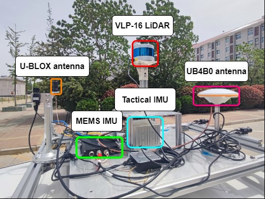

# Navigation-Datasets
### Improving GNSS/IMU/LiDAR fusion positioning using adaptive LiDAR keyframe selection and refined IMU preintegration

This repository is the usage page of the [Navigation-Dataset](https://pan.baidu.com/s/1Qc3cgB_Pm2_B9YVyhkJkWg)（ 0ddp ）. The demand for real-time high-precision location services by humans is increasing day by day. In complex environments such as urban canyons, shaded roads, and overpasses, even multi frequency and multi system GNSS fusion processing cannot ensure continuous and reliable positioning. The Navigation dataset aims to provide a challenging data source for communities (LiDAR GNSS IMU) to further accelerate research on accurate and robust positioning in challenging urban canyons.

  

**The Navigation-Datasets Description**
 - one dynamic vehicle dataset recorded on April 17th, 2023;
 - Average driving speed of 10 m/s;

  
**Sensor setups**
The on-board platform is equipped with the following sensors:
 - a low-cost UBLOX F9P receiver;
 - a Velodyne VLP16 LiDAR；
 - a tactical INS StarNeto XW-GI7660.

  

**The outer lever arm distance**
XWYD-UBLX  
Right:-0.312 Front:-0.393 Upper:0.232
XWYD-LiDAR
 extrinsicRPY:[0, -1, 0,
 1, 0, 0,
  0, 0, 1]
extrinsicTrans:
Right:0 Front: 0 Upper:0.384
